# Math Wiki

> 面向考研数学一的个人知识管理、错题复盘与学习规划系统。

Math Wiki 不是一个简单的电子错题本，而是一套围绕“知识整理—错题记录—定期复习—进度分析—计划执行”构建的个人学习工作台。项目将高等数学、线性代数、概率论与数理统计的知识内容，与错题、复习记录、学习日志、Todo 日历和阶段成绩连接起来，帮助学习者持续沉淀自己的数学知识体系。


---

## 项目定位

考研数学的内容多、周期长、重复遗忘明显。传统笔记、纸质错题本和零散表格往往彼此割裂：知识点写在一个地方，错题记录在另一个地方，复习计划又单独维护，时间久了很难快速判断“自己究竟哪里薄弱、哪些题需要重做、最近是否真的在进步”。

Math Wiki 尝试把这些行为集中到一个统一界面中：

- 以 **数学一科目—章节—知识点** 建立结构化知识体系；
- 将错题与具体知识点关联，保留题目、解法、错因与总结；
- 通过今日复习、复习历史和状态变化形成复习闭环；
- 通过学习日志、成绩趋势、目标进度和热力图观察长期变化；
- 通过 Todo 日历安排每天的学习任务；
- 通过访客只读模式展示项目框架，同时隔离个人真实数据。


---

## 核心学习闭环

Math Wiki 的核心不是“存资料”，而是让每一条知识和每一道错题都能参与后续复习。

1. **整理知识**：按科目、章节和小知识点建立 Markdown 知识页面。
2. **记录错误**：保存题目、正确解法、错误原因、总结和标签。
3. **安排复习**：根据复习状态设置下次复习时间，并保留复习历史。
4. **观察变化**：在总览、成绩趋势和学习统计中查看薄弱方向与进步情况。

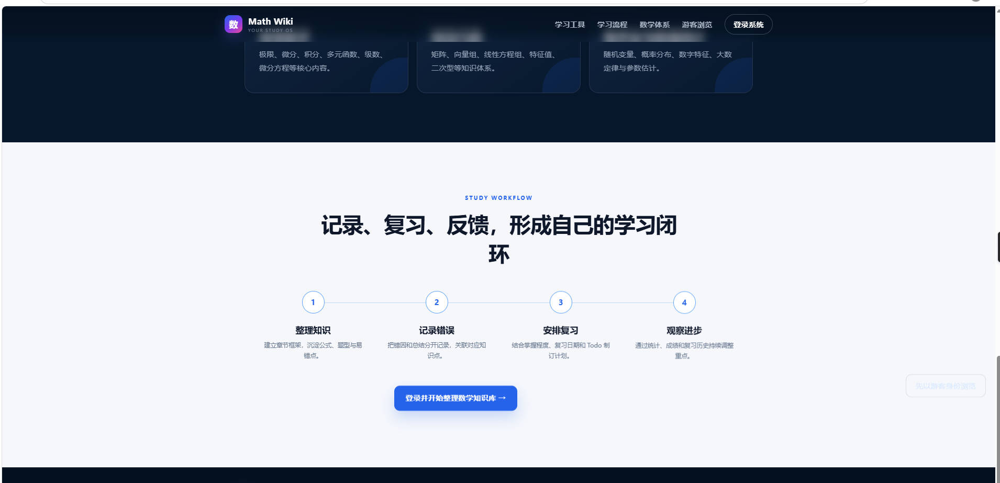

---

## 功能概览

### 1. 数学一知识体系

知识点按照以下层级组织：

```text
科目
└── 章节
    └── 小知识点
        ├── 核心概念
        ├── 公式与定理
        ├── 典型题型
        ├── 易错点
        └── 关联错题
```

系统覆盖：

- 高等数学
- 线性代数
- 概率论与数理统计

知识点正文支持 Markdown 与数学公式渲染，可用于整理定义、定理、推导、表格、题型和复习清单。独立详情页提供章节导航、知识点目录和正文目录，适合像 Wiki 一样逐层阅读。

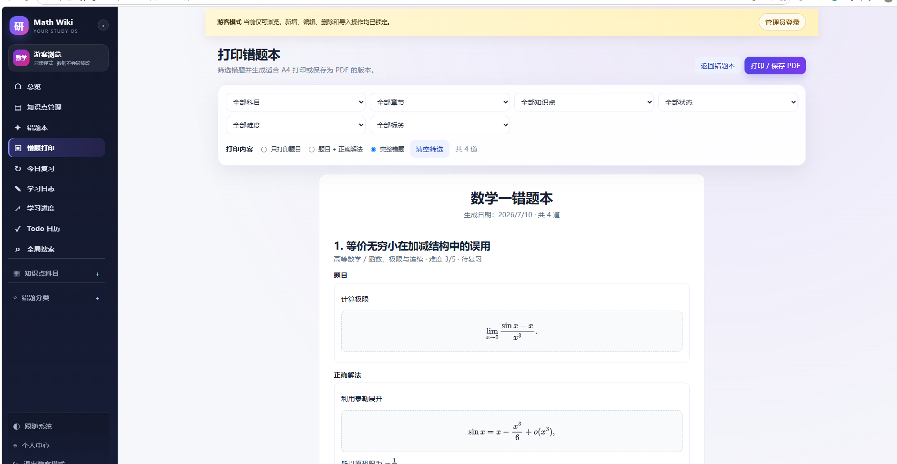

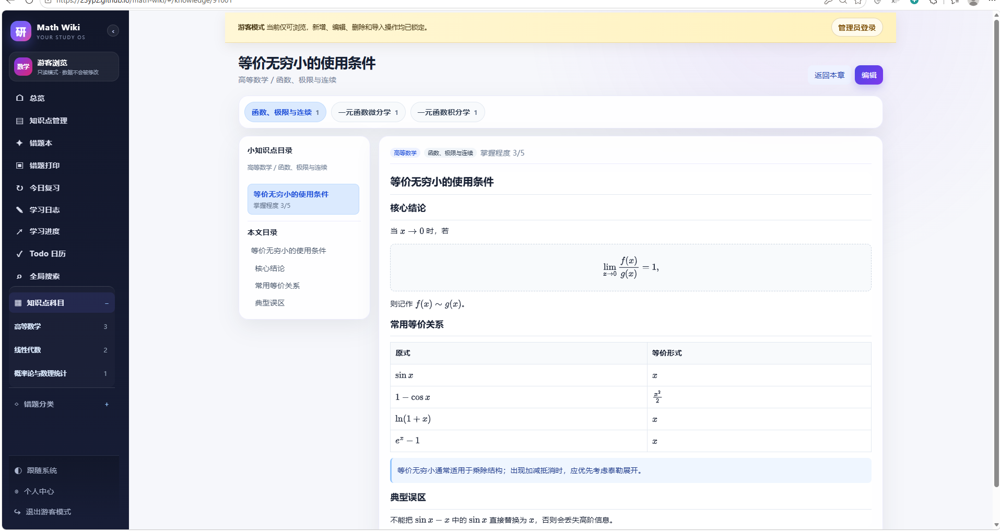

---

### 2. 错题管理与分类

每道错题不仅保存题目和答案，还可以记录：

- 所属科目与章节
- 关联知识点
- 来源与难度
- 正确解法
- 我的错误思路
- 错误原因
- 总结与可迁移方法
- 错误类型标签
- 当前掌握状态
- 下次复习日期
- 历次复习记录

错误原因与总结使用独立字段，避免“为什么错”和“以后怎么做”混在一起。错题可按科目、章节、状态、难度、标签、知识点和复习时间进行筛选与排序。

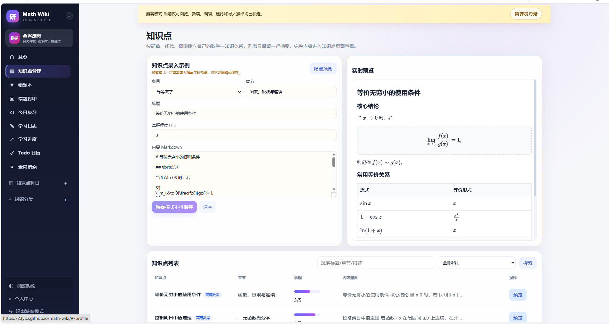

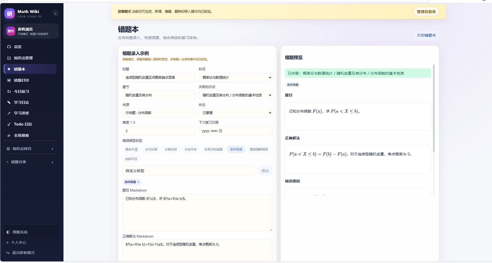

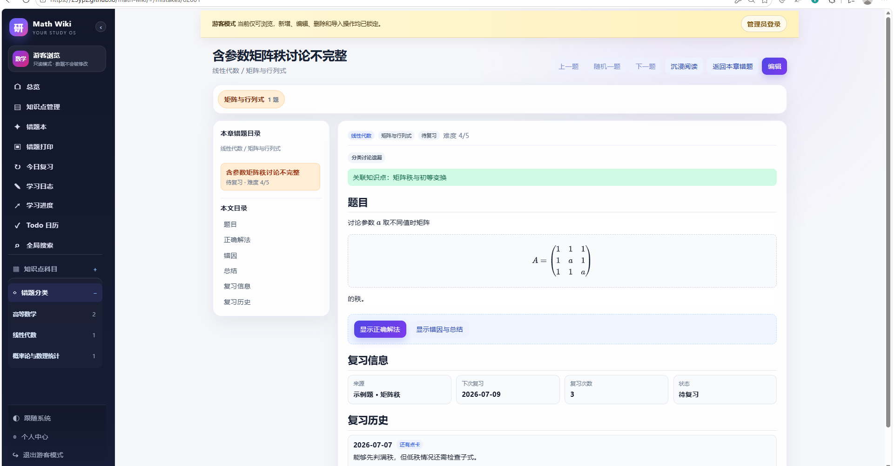

---

### 3. 今日复习与复习历史

系统会集中展示当天到期和已经逾期的错题。完成复习后，可以根据实际掌握情况选择：

- 还是不会
- 还有点卡
- 完全会了

系统据此更新状态和下一次复习时间，并在错题详情中保留复习历史。这样可以清楚看到一道题从“不会”到“掌握”的变化过程。

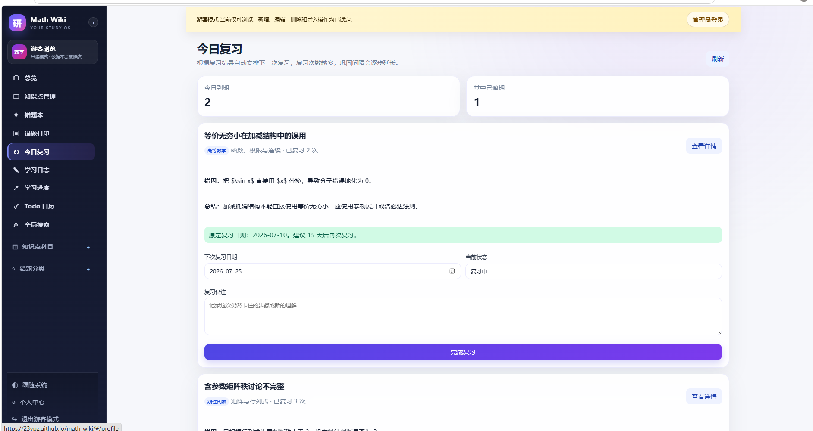

---

### 4. 学习总览

总览页集中呈现当前学习状态，包括：

- 知识点数量
- 错题数量与待复习数量
- 本周学习时长
- Todo 完成情况
- 薄弱章节
- 学习热力图
- 最近学习记录
- 阶段目标
- 成绩变化

总览页更像一个每天打开的学习仪表盘，用于快速确认“今天要做什么”和“最近哪里最需要加强”。

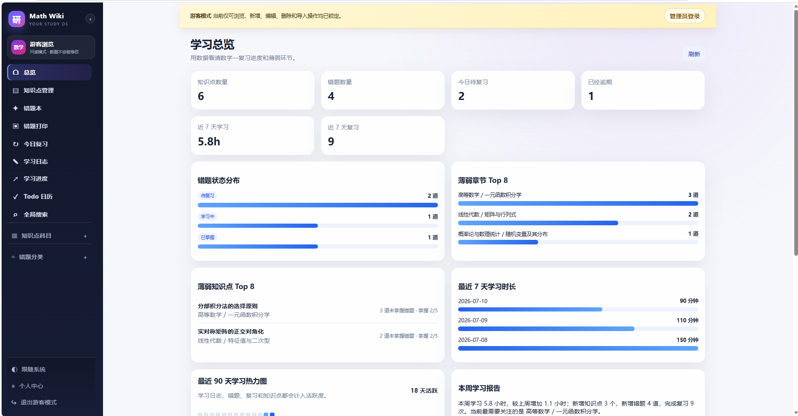

---

### 5. Todo 日历

Todo 模块使用月历组织每日任务。点击任意日期即可查看和安排当天计划，任务支持：

- 任务类型
- 科目与章节
- 优先级
- 状态
- 开始时间
- 备注
- 延期到下一天
- 标记完成

月历同时显示当日任务摘要、完成数量和完成率，适合规划刷题、复习、真题训练和知识整理。

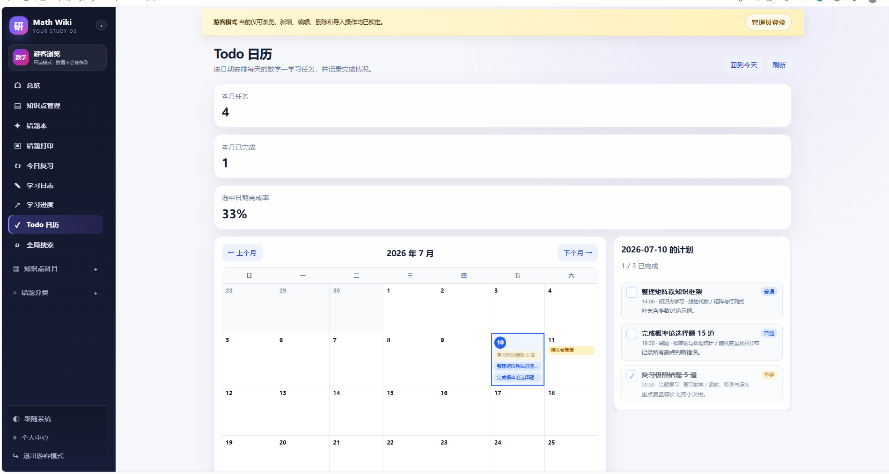

---

### 6. 学习日志

学习日志用于记录每天实际完成的学习内容，包括科目、时长、完成事项和复盘总结。日志既能作为日常记录，也能为学习热力图、周报和累计时长提供数据来源。

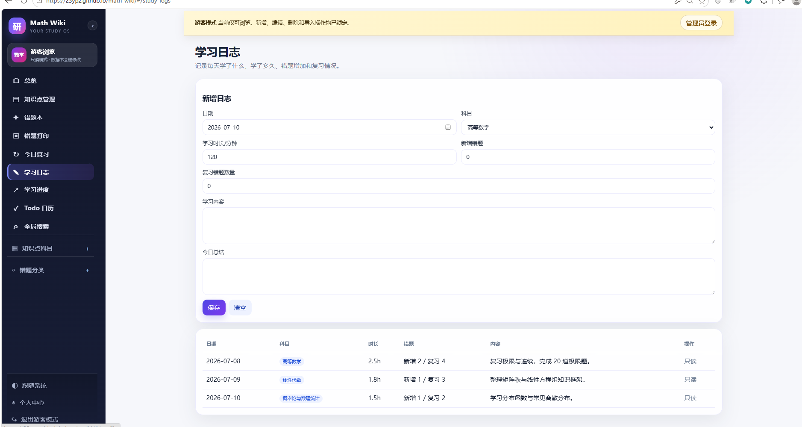

---

### 7. 成绩与阶段目标

学习进度模块可以记录真题、模拟卷、阶段测试和章节测试，包括：

- 总分
- 高数、线代、概率分项成绩
- 用时
- 错题数量
- 考试日期
- 备注

系统会生成成绩趋势，并统计平均分、最高分和近期变化。阶段目标支持目标值、当前进度、截止日期和完成状态，用于管理周计划、月计划和阶段复习任务。

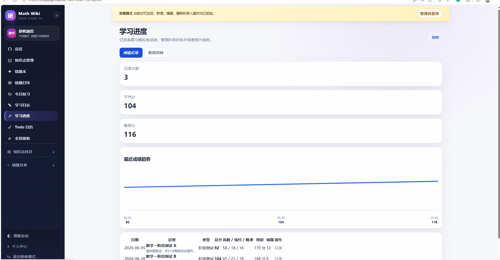

---

### 8. 个人中心

个人中心用于展示个人备考信息与长期积累，包括：

- 昵称与个性签名
- 目标院校与专业
- 考试年份与目标日期
- 每日学习目标
- 数学目标分数
- 累计学习时长
- 知识点、错题、复习和 Todo 统计
- 当前目标完成情况

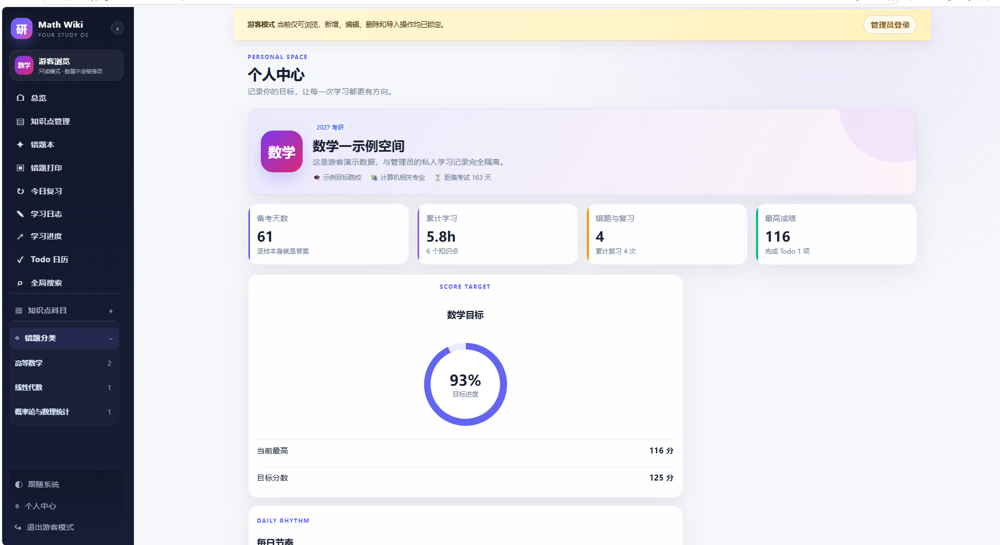

---

### 9. 全局搜索

全局搜索可以跨模块检索：

- 知识点标题与正文
- 错题标题、题目、解法、错因和总结
- 学习日志内容
- 科目、章节、来源和标签

搜索结果按类型分组，适合在内容积累较多后快速定位资料。

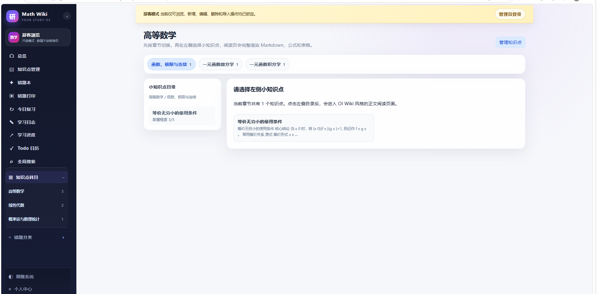

---

### 10. 游客只读演示

项目支持游客模式。游客无需登录即可浏览预设的知识点、错题、复习、Todo、成绩与个人中心示例，同时可以看到知识点和错题的完整录入框架与实时预览。

游客数据与管理员真实数据完全隔离，并且所有输入、保存、编辑、删除和导入操作都会被锁定。该模式适合公开展示项目，而不会暴露个人学习内容。

---

## 首页与视觉设计

项目首页采用深色沉浸式视觉风格，以“构建自己的考研数学知识系统”为核心表达，并通过滚动淡入、错峰卡片和渐变光效展示主要功能。

首页并非简单登录框，而是完整介绍产品能力；用户可以从首页选择管理员登录或游客浏览。


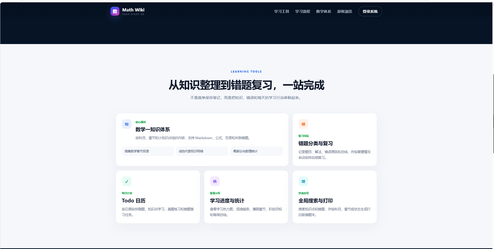

---

## Markdown 与数学公式

知识点和错题内容使用 Markdown 录入，并支持 MathJax/LaTeX 数学公式。例如：

```markdown
当 $x \to 0$ 时，如果

$$
\lim_{x\to 0}\frac{f(x)}{g(x)}=1,
$$

则称 $f(x)$ 与 $g(x)$ 为等价无穷小。
```

这种方式适合记录：

- 极限与积分
- 矩阵和行列式
- 分段函数
- 概率分布
- 公式推导
- 表格与复习清单

知识点、题目、解法、错误原因和总结均可独立预览，长内容区域支持滚动浏览。

---

## 数据与隐私设计

Math Wiki 将管理员真实数据与游客演示数据分离：

- 管理员登录后读取和维护个人真实数据；
- 游客只读取前端预设的演示内容；
- 游客没有数据库访问权限；
- 所有写操作均受前端状态和后端鉴权双重限制；
- 导入、导出、个人资料修改等敏感操作仅对管理员开放。

项目以个人使用为主要场景，因此重视数据可控性和长期维护，而不是复杂的多用户社交功能。

---

## 数据备份与输出

系统支持将学习内容导出为结构化备份，用于长期保存和迁移。备份内容可覆盖：

- 知识点
- 错题与标签
- 学习日志
- 复习历史
- 成绩记录
- 阶段目标
- Todo
- 个人资料

错题还支持生成适合阅读和打印的版式，可以按科目、章节、知识点、状态、难度和标签筛选，并选择：

- 只打印题目
- 题目与正确解法
- 完整错题内容

---

## 响应式体验

系统针对桌面端、平板和手机进行了响应式处理：

- 桌面端使用固定侧栏与宽内容区；
- 平板端使用抽屉式导航；
- 侧栏顶部、中部和底部分区滚动；
- 知识点科目和错题分类可折叠；
- 移动端表单改为单列布局；
- 公式、代码块和长表格支持横向滚动；
- 首页在触屏设备上降低高消耗动画，保留必要的淡入效果。

---

## 技术特点

项目主要采用以下技术构建：

- **Vue 3**：组件化前端界面
- **TypeScript**：类型安全与可维护性
- **Vite**：前端开发与构建
- **Vue Router**：页面与详情路由
- **Markdown + MathJax**：知识内容与数学公式渲染
- **Node.js / Express**：后端接口
- **JWT**：管理员身份认证
- **TiDB Cloud**：结构化学习数据存储
- **CloudBase 云托管**：后端服务运行

项目在设计上保持前端展示、后端鉴权和数据库存储之间的清晰边界，便于后续维护和扩展。

---

## 适用场景

Math Wiki 适合以下使用方式：

- 考研数学一长期复习
- 高等数学、线性代数和概率论课程整理
- 个人知识库与电子错题本
- 真题与模拟卷成绩跟踪
- 每日学习计划管理
- 面向同学或老师展示个人学习系统
- 借助大模型从题目图片生成 Markdown 后快速录入

---

## 项目特色

与普通错题本相比，Math Wiki 更强调以下几点：

- **知识与错题关联**：错题不再孤立存在，而是回到具体知识结构中。
- **错误原因与总结分离**：既分析本次为什么错，也记录下次应该怎么做。
- **复习过程可追踪**：保留每次复习结果和状态变化。
- **计划与结果结合**：Todo、学习日志、成绩和阶段目标共同反映执行情况。
- **管理员与游客隔离**：公开展示项目时不暴露个人真实数据。
- **数学内容友好**：Markdown、LaTeX、目录与打印版式均围绕数学学习优化。
- **适合长期积累**：从几条笔记逐步扩展为完整的个人数学知识体系。

---

## 项目愿景

Math Wiki 希望解决的不是“如何保存更多笔记”，而是：

> 如何把知识点、错题、复习计划和学习反馈连接起来，让每一次记录都能指导下一次学习。

它既是一个数学知识库，也是一个持续更新的个人学习系统。随着知识点、错题和复习记录不断积累，系统会逐步形成一份真正属于使用者自己的考研数学学习地图。

---

<p align="center">
  <strong>Math Wiki — Build your own mathematics learning system.</strong>
</p>
